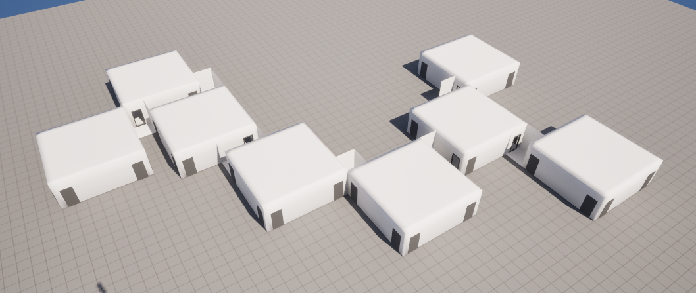

# Labyrinth Generation Unreal

This is a port of my [Unity Labyrinth Generation Package](https://github.com/jackpritz/labyrinth-generation) to Unreal Engine 5.6.

This project was chosen as a learning exercise to get more acquainted with Unreal Engine.

